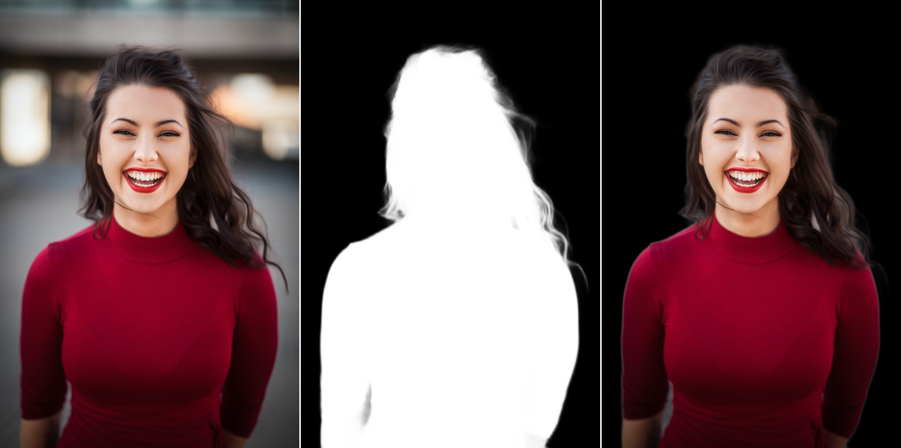
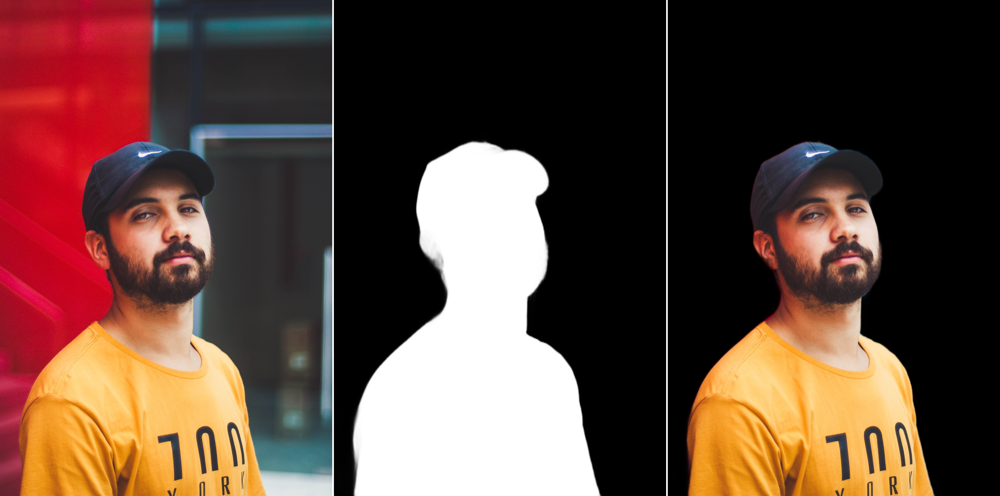
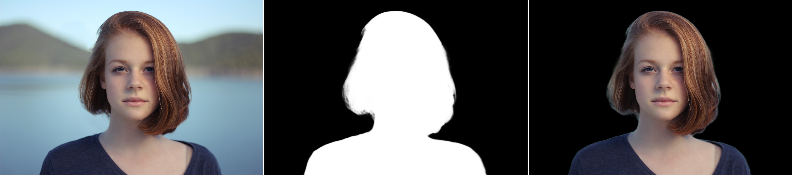

# U2-Net for Image Matting in TensorFlow

Welcome to the U2-Net for Image Matting in TensorFlow repository! This project showcases an implementation of the U2-Net architecture for image matting in the TensorFlow. The code includes the training process, making use of the Privacy-Preserving Portrait Matting Dataset (P3M-10k) to achieve accurate foreground extraction from images.

## Dataset
Privacy-Preserving Portrait Matting Dataset (P3M-10k) is used for training and validation process. P3M-10k contains 10421 high-resolution real-world face-blurred portrait images, along with their manually labeled alpha mattes.   
Download the dataset: 
- [Privacy-Preserving Portrait Matting Dataset (P3M-10k)](https://drive.google.com/uc?export=download&id=1LqUU7BZeiq8I3i5KxApdOJ2haXm-cEv1)
- [P3M-10k facemask (optional)](https://drive.google.com/file/d/1I-71PbkWcivBv3ly60V0zvtYRd3ddyYs/view?usp=sharing)

## Results
The sequence in the images below is as follows- `Input Image`, `Predicted Alpha Matte` and `Predicted Alpha Matte applied over Input Image`.    

## How to improve
- Train on more epochs.
- Increase the input image resolution.
- Apply data augmentation.
- Try new loss function.

## Contact
For more follow me on:

- <a href="https://www.youtube.com/idiotdeveloper"> YouTube </a>
- <a href="https://facebook.com/idiotdeveloper"> Facebook </a>
- <a href="https://twitter.com/nikhilroxtomar"> Twitter </a>
- <a href="https://www.instagram.com/nikhilroxtomar"> Instagram </a>
- <a href="https://t.me/idiotdeveloper"> Telegram </a>
